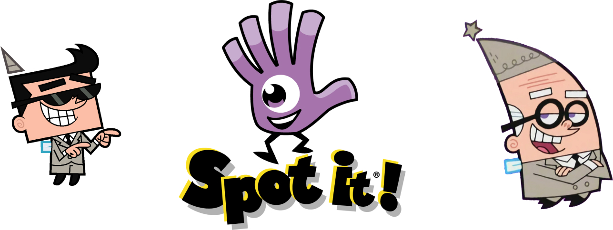

# Spot It - Team Pixies

[![Contributors][contributors-shield]][contributors-url]
[![Issues][issues-shield]][issues-url]

<!-- PROJECT LOGO -->
 

  

  <h2 align="center">Spot it! The Well</h3>
   
  <h3 align="center">
  Repositorio para el proyecto grupal del curso de desarrollo web CI-0137.
  

  

     
    <a href="http://129.153.234.175/">Play de game!!</a>
    ·
    <a href="https://github.com/DanielEscobar19/spot_it_pixies/issues">Report Bug</a>
    ·
    <a href="https://github.com/DanielEscobar19/spot_it_pixies/issues">Request Feature</a>
  

<!-- TABLE OF CONTENTS -->

  
Tabla De Contenidos

  <ol>
    <li>
      <a href="#acerca-del-proyecto">Acerca Del Proyecto</a>
      <ul>
        <li><a href="#adaptaciones">Adaptaciones</a></li>
        <!--
        <li><a href="#librerias">Librerias</a></li> -->
      </ul>
    </li>
    <li>
      <a href="#reglas">Reglas</a>
    </li>
    <!-- <li><a href="#uso">Uso</a></li>
    -->
    <li><a href="#mapa-del-sitio">Mapa del Sitio</a></li>
    <li><a href="#manual-de-uso">Manual de uso</a></li>
    <li><a href="#autores">Autores</a></li>
    <li><a href="#otras rutas">Otras rutas</a></li>
  </ol>

<!-- ABOUT THE PROJECT -->
## Acerca Del Proyecto

En este proyecto se desarrolla un mini juego, El Pozo (The Well), del juego Spot it. Se requiere contar con la capacidad de jugar en línea entre dos a ocho jugadores al mismo tiempo de modo que un jugador tenga el rol de anfitrión de la sesión y ésta cuente con un código que permite a los demás jugadores, invitados a participar en la misma partida.

El juego debe ser ejecutado mediante una plataforma web (servidor), respetando las reglas originales del juego; en adición, se espera implementar al menos dos adaptaciones extra que agregan funcionalidades (audiovisuales, cambio de reglas u otras) distintas a las que ya cuenta éste.

El sistema de juego debe contar con al menos la pantalla de créditos, ayuda, leaderboard (que contempla manejar una base de datos para registrar el ranking), salas de espera (anfitrión e invitados) y las pantallas principales del juego.

<a href="#spot-it---team-pixies">↑ volver al inicio</a>

### Adaptaciones

1. El contador de tiempo para las partidas, que sirve como un marcador de “mejor tiempo” para un jugador en el leaderboard. AL final de cada partida se actualiza el mejor tiempo de cada jugador y según los datos almacenados en el servidor.
   - Ejemplo - Al final de la partida.  
   
   - Ejemplo - Leaderboard.  
     

2. Botón de I'm ready para que el host solo puedar empezar la partida si todos los jugadores están listos.
   - Botón del lado del guest antes de ser clickeado  
     

   - Botón de play no clickeable del host cuando no todos están listos  
     

   - Botón de play clickeable del host cuando todos están listos  
     

3. Chat de eventos que marca un “historial” de los emparejamientos de cartas.
   - Ejemplo - Chat de eventos, incluye el uso del tiempo. Además esta chat es funcional y cualquier jugador puede enviar mensajes a través de este.  
     

3. Penalización al clickear la carta incorrecta de 5 segundos. Si el jugador clickea la carta incorrecta se penaliza con 5 segundos en los cuales no puede clickear ninguna carta.
   - Ejemplo de la penalización:  
     

<a href="#spot-it---team-pixies">↑ volver al inicio</a>

<!-- 
### Librerias

Librerias y frameworks usados para construir el proyecto:

[![Bootstrap][Bootstrap.com]][Bootstrap-url] (e.g)

<a href="#spot-it---team-pixies">↑ volver al inicio</a>

-->
<!-- GETTING STARTED -->
## Reglas

Coloca una carta boca abajo en el centro de la mesa y reparte el resto de las cartas boca abajo entre los jugadores. Todos los jugadores al mismo tiempo tratarán de encontrar un par de símbolos que se repitan. Si encuentras el símbolo lo dices en voz alta y la descartas en la pila central. Esta será la carta que utilizarás para buscar el próximo símbolo. El juego continúa hasta que uno de los jugadores se queda sin cartas. El primero en lograrlo gana el juego.

### Cartas

Spot it! Consta de 55 cartas, con 8 símbolos por carta de los 50 disponibles, solo hay un símbolo idéntico en común entre cada carta.

<!-- USAGE EXAMPLES
## Uso

-->

<!--SITEMAP-->
## Mapa Del Sitio

<a href="#spot-it---team-pixies">↑ volver al inicio</a>

<!-- ROADMAP -->
## Manual de uso

Se debe instalar Node.js: [Node.js](https://nodejs.org/en/)

Para jugar se puede ingresar a nuestra juego en la siguiente dirección: [Spot it](http://129.153.234.175/)

Para ejecutar el juego de forma local se debe abrir una temrinal en la carpeta de [src/server/](src/server/) y ejecutar los comando: 

    npm i
    npm dev run
Esto levanta el servidor y la aplicación automáticamente.
Nota: en la carpeta [src/spot-it](src/spot-it) tambien se debe ejecutar el comando npm i para instalar las dependencias de node.js

Otra opción es ejcutar el servidor y a la aplicación por aparte. Para esto se debe abrir una temrinal en la carpeta [src/spot-it](src/spot-it) y ejecutar los comando: 

    npm i
    npm start

Y abrir otra terminal en la carpeta [src/server/](src/server/) y ejecutar los comando:

    npm i
    npm start

<!-- AUTORES -->
## Autores

| Nombre               | Contacto                        |
| :---                 | :---                            |
| Fabián Orozco        | fabian.orozcochaves@ucr.ac.cr   |
| Daniel Escobar       | daniel.escobargiraldo@ucr.ac.cr |
| Gabriel Bonilla      | gabriel.bonillarivera@ucr.ac.cr |
| Manuel Arroyo        | manuel.arroyoportilla@ucr.ac.cr |

## Otras rutas

- [Link del proyecto en github](https://github.com/DanielEscobar19/spot_it_pixies)  
- [Link del prototipo en figma](https://www.figma.com/proto/7EKI0R0xJH1RVGjZheae10/Proyecto_Web?node-id=16%3A31&scaling=scale-down&page-id=0%3A1&starting-point-node-id=16%3A31&show-proto-sidebar=1)

<a href="#spot-it---team-pixies">↑ volver al inicio</a>

<!-- MARKDOWN LINKS & IMAGES -->
<!-- https://www.markdownguide.org/basic-syntax/#reference-style-links -->
[contributors-shield]: https://img.shields.io/badge/Contributors-4-green?style=for-the-badge
[contributors-url]: https://github.com/DanielEscobar19/spot_it_pixies/graphs/contributors
[issues-shield]: https://img.shields.io/badge/Issues-0-orange?style=for-the-badge
[issues-url]: https://github.com/DanielEscobar19/spot_it_pixies/issues

[Bootstrap.com]: https://img.shields.io/badge/Bootstrap-563D7C?style=for-the-badge&logo=bootstrap&logoColor=white
[Bootstrap-url]: https://getbootstrap.com