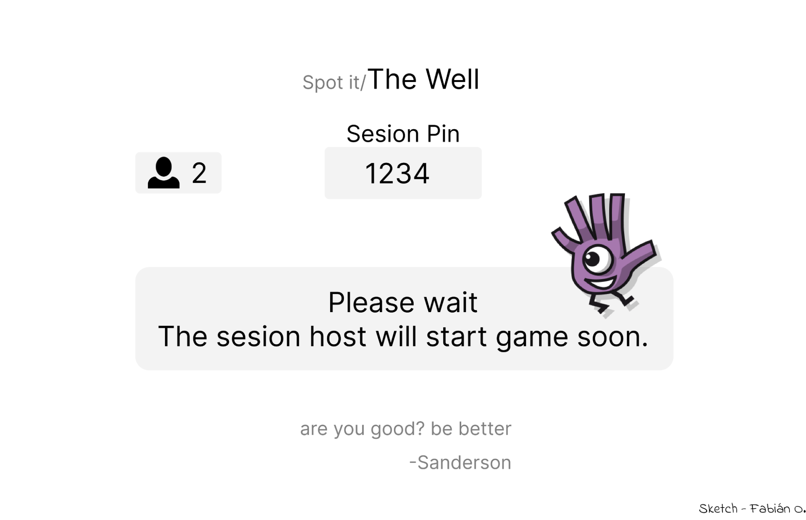
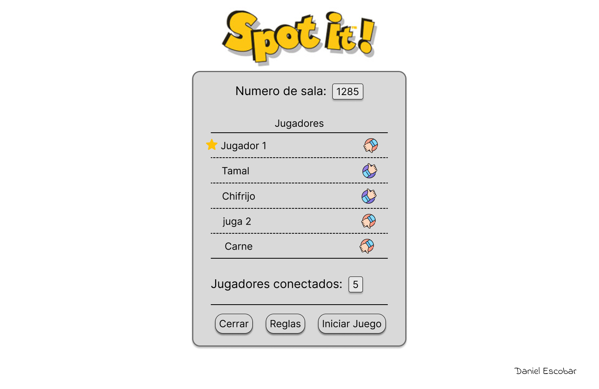
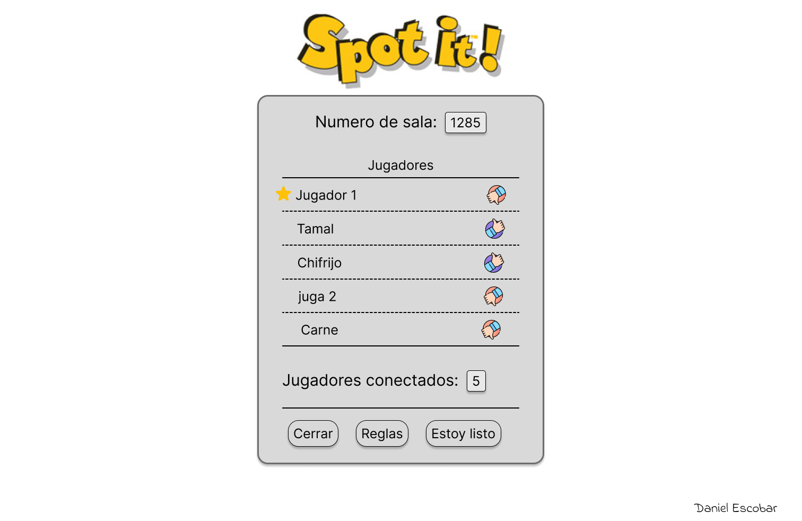
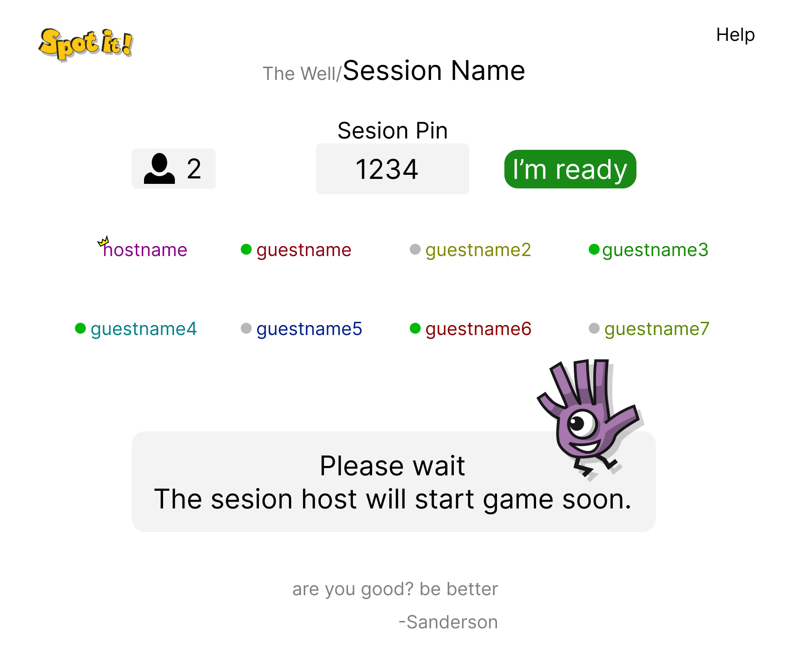
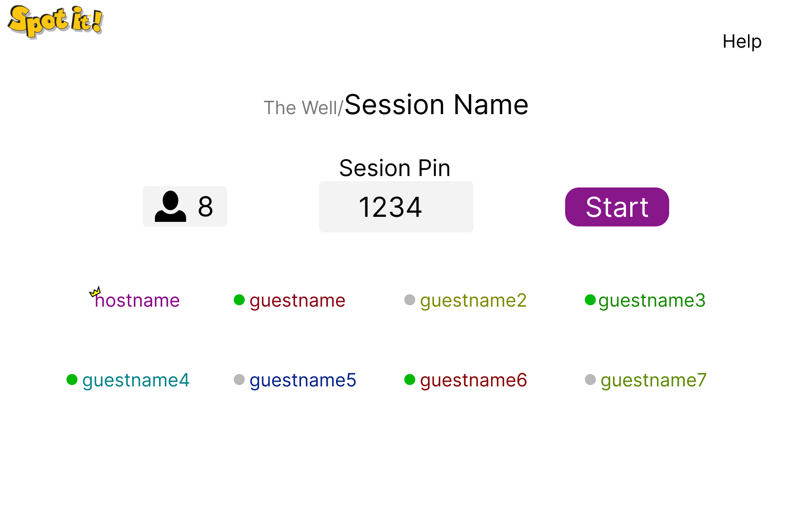
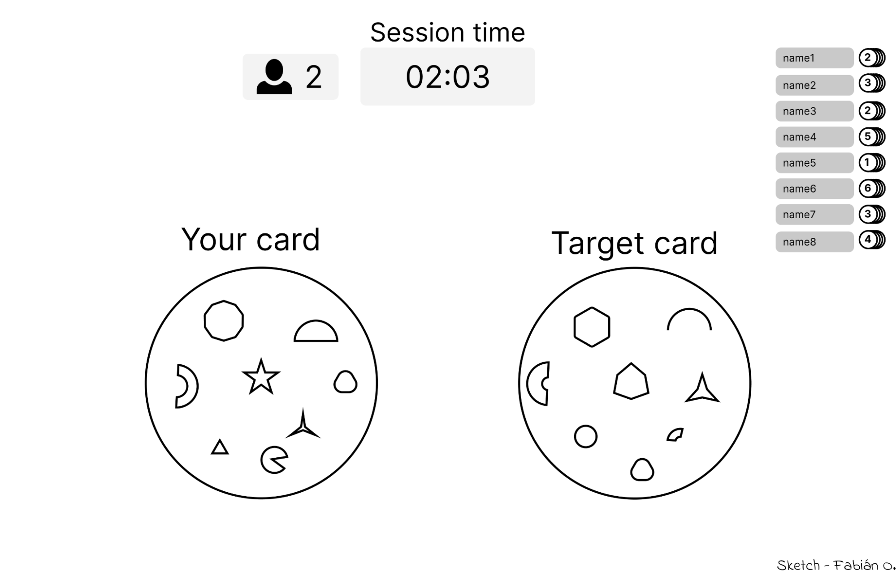
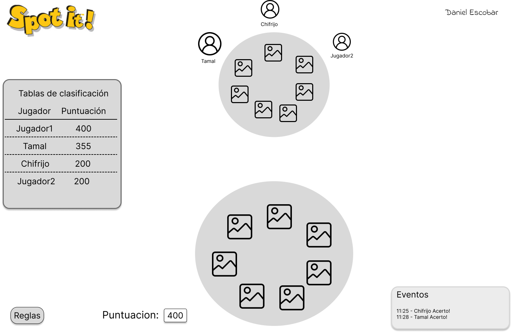
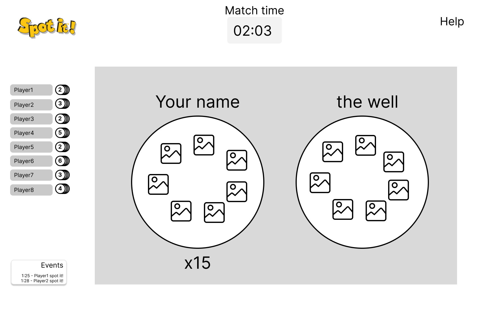
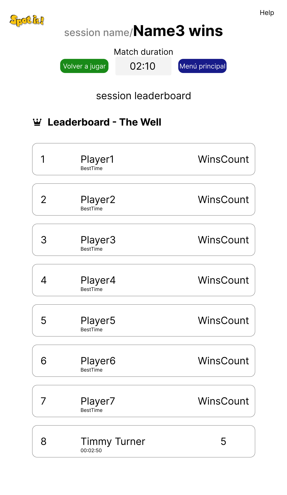

# Diseño

En cuanto a los acuerdos realizados como equipo, se decidió utilizar los sketches de los compañeros Daniel y Fabián, ya que eran los más detallados. El que se utilizó como base fue el de Fabián, luego de realizar una votación entre los integrantes del grupo. No obstante cada integrante realizó un sketch diferete del producto. Aquí los links a tales sketches:

El principal cambio realizado al sketch de Fabián fue en la sala de espera (A) tanto de los invitados como del anfitrión. En el caso del anfitrión, se muestra cuáles jugadores están listos y cuáles no. Algo similar ocurre con la pantalla de espera de los invitados, con la única diferencia que estos pueden presionar un botón para mostrarse como listos o no listos para jugar, esto para dar mayor control a los usuarios y que el sistema se muestre más amigable.

Estos cambios fueron adoptados de las salas de espera realizadas por Daniel (B). Además se decidió agregar el botón de Help que muestra en un popup las reglas del juego para que los jugadores puedan repasar durante la espera.

<table>
  <tr>
    <th>Sala de espera A</th>
    <th>Sala de espera B</th>
  </tr>
  <tr>
    <td>   </td>
    <td>   </td>
  </tr>
</table>

<table>
  <tr>
    <th>Resultado</th>
  </tr>
  <tr>
    <td> </td>
  </tr>
</table>

En las pantallas de espera podemos ver que al anfitrion decidimos agregarle un ícono de una corona para indicar que este es el dueño de la partida actual porque le es útil al invitado saber cual es el anfitrión para facilitar la comunicación. Por ejemplo si los jugadores están en llamada y la partida no empieza es porque el anfitrión no le ha dado empezar y es posible que el mismo anfitrión no sepa que el tiene la responsabilidad de iniciar la partidad. De esta forma cualquier jugador puede ver quien es el anfitrión y recordarle que debe iniciar la partidad.

Para la pantalla de juego, se decidió hacer un reacomodo general de los elementos, y se le agregó la sección de Eventos del sketch de Daniel, además se consideró tener que agregar un contador para las cartas que le quedan en la pila/mano del jugador. Así todos los jugadores peuden ver quien esta más cerca de ganar. Tambien estamos considerando la idea de que la lista de jugadores este ordenada de forma que arriba aparezca el jugador que va ganando.

<table>
  <tr>
    <th>Pantalla de juego A</th>
    <th>Pantalla de juego B</th>
  </tr>
  <tr>
    <td></td>
    <td></td>
  </tr>
</table>

<table>
  <tr>
    <th>Resultado</th>
  </tr>
  <tr>
    <td></td>
  </tr>
</table>

Se le agregó a cada pantalla un logo del juego en la esquina superior izquierda que funciona como botón de Home, para que haya un flujo de salida en cada una de ellas y así el usuario no se sienta atrapado en una sola pantalla. Esta imagen no se definido y la que se puso es provisional.

Con respecto al leaderboard se decidió que al final de cada partida se mostrarán los resultados de la partidad se agregaron los botones de volver a jugar y de menú principal para simplificar el flujo al terminar un partidad. Además la tabla es bastante sencilla, esta muestra por cada jugador cunatas victorias lleva desde que se emnpezó la sesión y cual es su mejor tiempo, es decir su velodcidad para ganar/temrinar la partidad. 

<td></td>

<a href="#spot-it-pixies">↑ volver al inicio</a>

