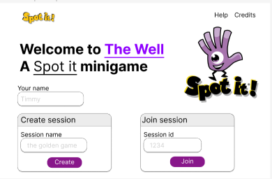
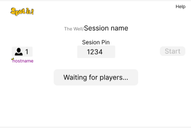
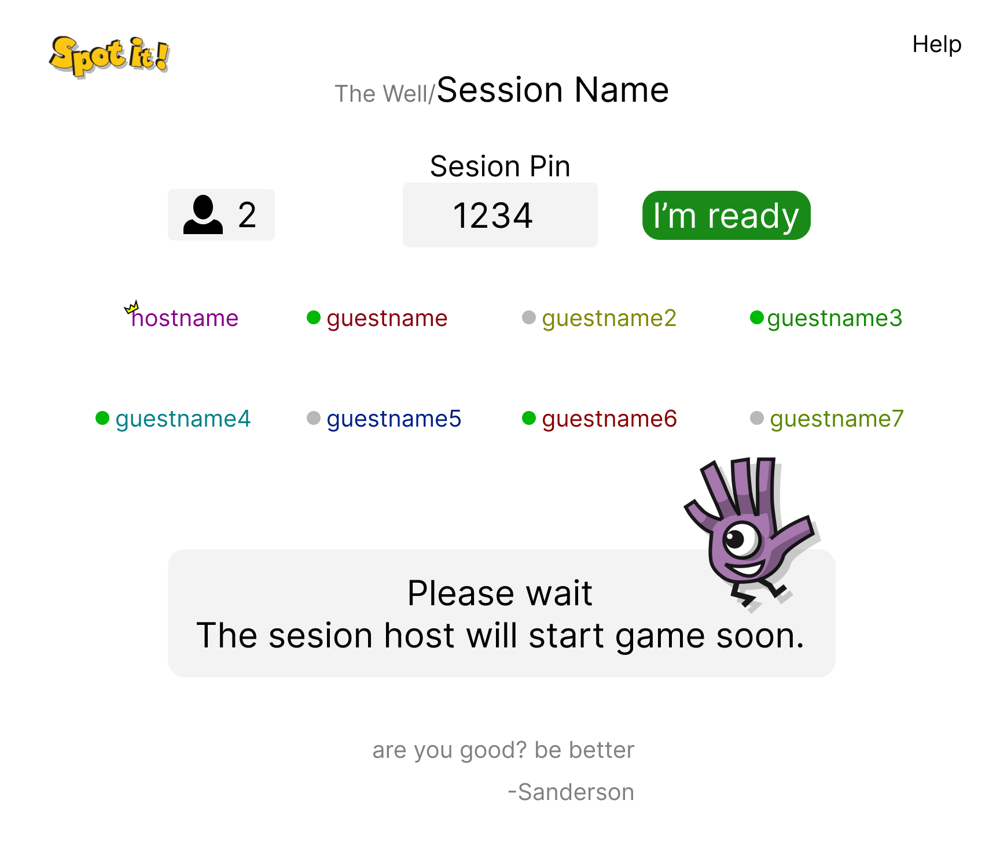
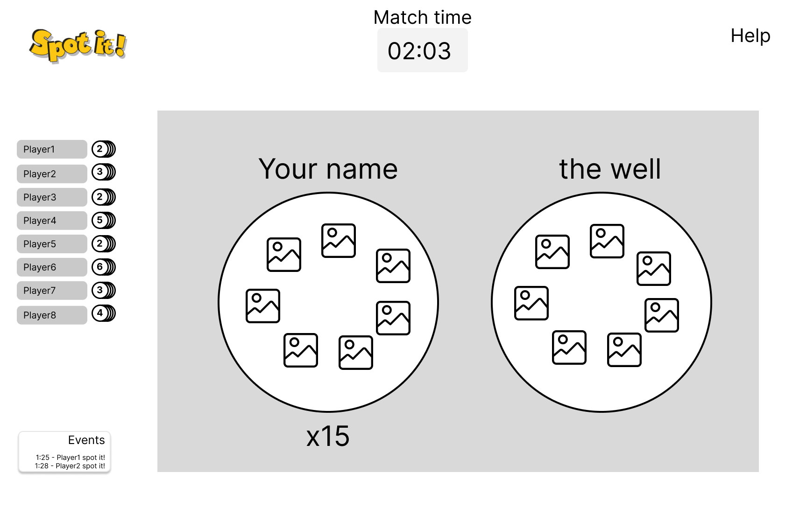
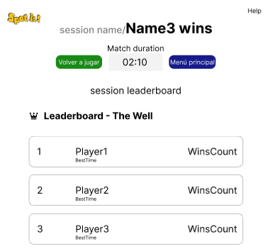
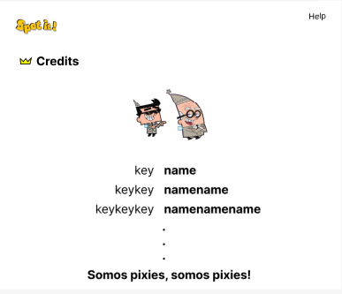
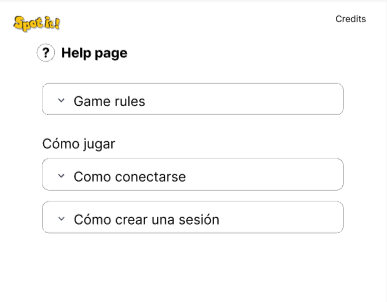
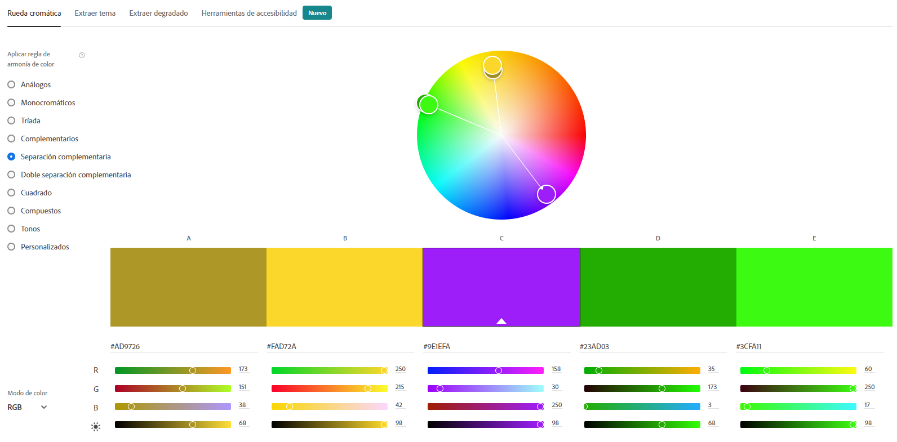

# Justificación del diseño

## Pantalla Principal

En el encabezado de la pantalla, se muestran las opciones para dirigirse a la pantalla de Ayuda (Help) y de Créditos (Credits). Por otro lado, el usuario puede decidir si crear una sesión o unirse a una existente. En el caso de que el usuario decida crear una sesión, deberá agregar el nombre de la misma y presionar el botón de "Create", el cual lo va a redirigir a la pantalla de espera del anfitrión. Por otro lado, si el usuario desea ingresar a una sesión existente, este deberá ingresar el códgio de la sesión a la que desea ingresar y posteriormente presionar el botón de "Join"; en caso de que el número de sesión ingresado sea válido, se redirige a la sala de espera de invitados.  

Para ingresar a ella desde otras aplicaciones solo se necesita presionar el logo del juego en la esquina superior izquierda  

  

## Sala de espera anfitrión sin jugadores

En esta pantalla se muestra cómo se vería la pantalla de espera del anfitrión en caso de que aún no haya ingresado ningún jugador. En este caso, se le muestra al anfitrión que se está esperando a que se unan mas jugadores y el PIN de la sesión. La opción de "Start" o de empezar la partida se encuentra desabilitada.    

  

## Sala espera anfitrión con jugadores

Al igual que en la pantalla anterior, se muetra el PIN de la sesión, así como la cantidad de jugadores que se han unido. Lo que se agrega en esta pantalla es el nombre de cada uno de los jugadores y si se encuentran listos o no. En caso de que se presione el botón "Start", se iniciará la partida con los jugadores que se encuentren listos y se redirige a la pantalla de juego.    

  

## Sala espera Invitado

Se muestra el PIN de la sesión, la cantidad de jugadores conectados, así como sus nombres y si están listos o no. La acción que el usuario puede realizar es la de presionar el botón de "I'm ready", el cual hará que se le redirija a la pantalla de juego, en caso de que el anfitrión inicie la partida.  

  

## Pantalla de juego

Esta pantalla es la misma para todos los jugadores, independientemente si es anfitrión o invitado. Aquí se le muestra al usuario la carta que tiene visible y cuantas le quedan para ganar, así como la carta que se encuentra en el tope del pozo. En caso de que el usuario haga click a la imagen que hace pareja con alguna de su carta, se reemplaza su carta por la siguiente en su mazo, y se posiciona la carta con la que ganó la ronda sobre el pozo. En el caso de un jugador que no logró acertar en esa ronda, se le va a mostrar solamente el cambio de la carta encima del pozo.  

Por otro lado, se muetra la lista de jugadores y la cantidad de cartas que le queda a cada uno para ganar. En caso de que un jugador tenga una carta, se le va a notificar al resto por medio de una animación. Por último, en la esquina inferior izquierda, se muestra una sección de eventos donde se muestran los diferentes eventos que van ocurriendo en el juego.  

En caso de que algún jugador gane, se redirige a todos a la pantalla de finalización del juego.   

  

## Pantalla de finalización del juego

Se muestra el nombre de la partida, el nombre del ganador, la duración de la partida, un "Leaderboard" basada en la cantidad de partidas ganadas por el jugador en la sesión y dos botones: Uno para volver a jugar y otro para volver a la pantalla principal. En caso de que un invitado seleccione "Volver a jugar", se le redirige a la sala de espera de invitados, lo opuesto ocurre para el anfitrión.  

  

## Pantalla de créditos

Para dirigirse a esta pantalla se necesita presionar el botón de "Credits" localizada en la pantalla principal. Para salirse de ella solamente se necesita presionar el logo de la aplicación en la esquina superior derecha, lo cual lo redirige a la pantalla principal.
  

  

## Pantalla de ayuda

Para ingresar a esta pantalla solo se presiona el botón de "Help" en el encabezado de todas las páginas. Para salirse solo se preiona el logo del juego en la esquina superior derecha.  

## Paleta de color

Fue elegida utilizando <a href="https://color.adobe.com/">Adobe Color</a>, basándonos en los colores orignales de spot it.

## Máquina de estados

## Otras rutas

- [Link del prototipo en figma](https://www.figma.com/proto/7EKI0R0xJH1RVGjZheae10/Proyecto_Web?node-id=16%3A31&scaling=scale-down&page-id=0%3A1&starting-point-node-id=16%3A31&show-proto-sidebar=1)